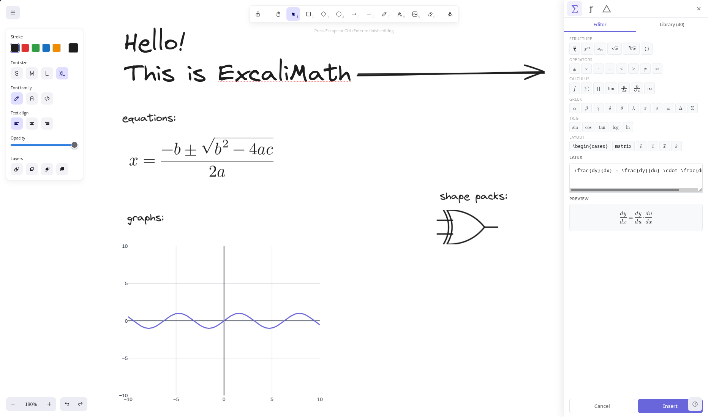

# ExcaliMath Demo

Live demo of [@excalimath/core](https://github.com/DynoW/excalimath) — a math companion plugin for Excalidraw.

**Try it:** [excalimath.my-lab.ro](https://excalimath.my-lab.ro)



## What This Shows

- **LaTeX equations** — insert and edit equations via a visual toolbar (KaTeX)
- **Function graphs** — plot up to 5 colour-coded functions per graph (Plotly.js)
- **STEM shape libraries** — 80+ drag-and-drop shapes across algebra, biology, chemistry, geometry, physics, and statistics
- **Auto-save** — canvas and library data persist to localStorage across sessions
- **Theme support** — toggle light/dark; preference is saved
- **Library URL import** — install community libraries via `#addLibrary` URL hash

## Tech Stack

| Layer | Dependency |
|---|---|
| Framework | [React 18](https://react.dev) |
| Canvas | [@excalidraw/excalidraw](https://www.npmjs.com/package/@excalidraw/excalidraw) |
| Plugin | [@excalimath/core](https://www.npmjs.com/package/@excalimath/core) |
| Bundler | [Vite 5](https://vitejs.dev) |
| Deployment | [Cloudflare Pages](https://pages.cloudflare.com) |

## Development

```bash
git clone https://github.com/DynoW/excalimath-demo.git
cd excalimath-demo
npm install
npm run dev     # local dev server (default :5173)
npm run build   # production build → dist/
npm run preview # preview the production build
```

## Related

- [@excalimath/core](https://github.com/DynoW/excalimath) — the plugin package
- [ExcaliMath for VS Code](https://marketplace.visualstudio.com/items?itemName=DynoW.excalimath-vscode) — VS Code extension